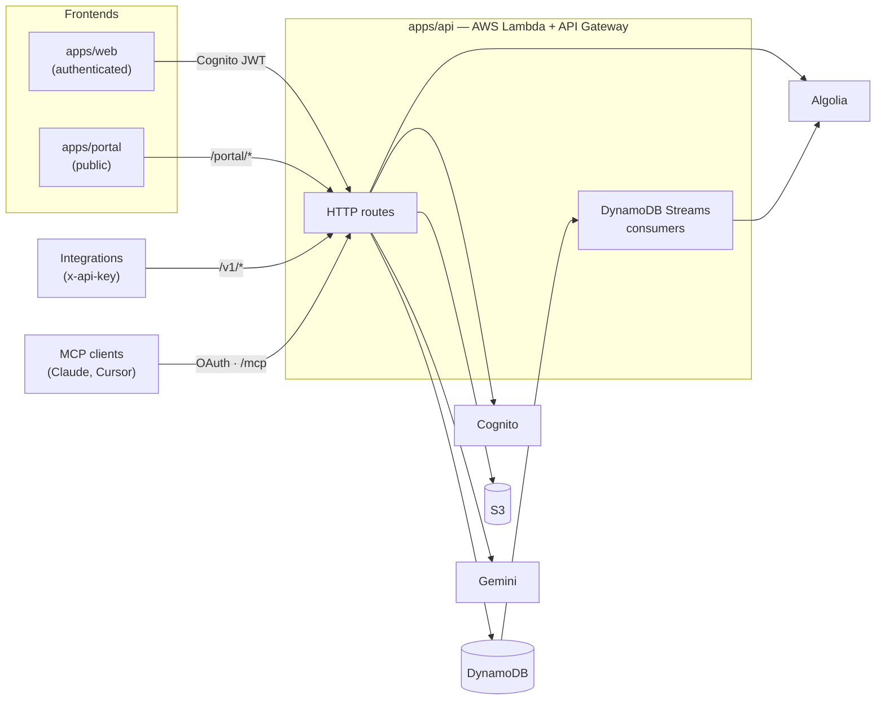

# Collectshare

[Português](./README.md) · **English**

A platform to build forms, collect responses and publish them as **open data**, with personal data anonymized (LGPD, Brazil's data protection law) before anything is published.

- **App** (`apps/web`): build forms, track responses in a filterable dashboard, export CSV and manage API keys.
- **Open-data portal** (`apps/portal`): public search over published datasets, paginated browsing and CSV download, no login required.
- **External `/v1` API**: programmatic access with scoped API keys.
- **MCP server**: connect Claude, Claude Code or Cursor to your account over OAuth and manage forms in natural language.

## Architecture



## Stack

| Part | Technologies |
|---|---|
| Monorepo | pnpm workspaces, Turborepo |
| `apps/api` | TypeScript, Serverless Framework, AWS Lambda (Node 24, arm64), DynamoDB (single-table), Cognito, S3, SQS, Algolia, Gemini, Zod, Vitest |
| `apps/web` | React 19, Vite, TailwindCSS v4, TanStack Query, React Router |
| `apps/portal` | React 19, Vite, TailwindCSS v4, TanStack Query |
| `packages/ui` | Shared design-system components (`@monorepo/ui`) |
| `packages/shared` | Shared entities, types and enums (`@monorepo/shared`) |
| `infra/` | Terraform (portal hosting and CI/CD) |

## Layout

```
apps/
  api/        # Serverless backend (Clean Architecture + custom DI)
  web/        # Authenticated app
  portal/     # Public open-data portal
packages/
  shared/     # Shared domain
  ui/         # Design system
infra/        # Portal Terraform
docs/         # Design notes and PRDs
openspec/     # Change proposals (OpenSpec)
```

## Getting started

Requirements: **Node.js 24**, **pnpm 10** and, to deploy the API, AWS credentials (profile `pessoal`) and the Serverless Framework.

```bash
pnpm install
pnpm dev          # starts web and portal (Vite)
```

The API has no local server; it is deployed to AWS. While developing, use `pnpm --filter @monorepo/api typecheck` and `pnpm --filter @monorepo/api test`, and point the frontends at a dev stack.

### Environment variables

Each app has its own `.env` (the frontends ship a `.env-exemple` template).

| App | Variables |
|---|---|
| `apps/web` | `VITE_API_URL`, `VITE_APP_CLARITY_ID`, `VITE_APP_SENTRY_DSN`, `SENTRY_AUTH_TOKEN`, `SENTRY_ORG`, `SENTRY_PROJECT` |
| `apps/portal` | `VITE_API_URL`, `VITE_WEB_APP_URL` |
| `apps/api` | `ALGOLIA_APP_ID`, `ALGOLIA_ADMIN_API_KEY`, `ALGOLIA_INDEX_NAME`, `MASTER_SECRET`, `EXPORT_SECRET`, `GEMINI_API_KEY`, `WEB_APP_URL`, `API_DOMAIN_NAME`, `ROUTE53_HOSTED_ZONE_ID`, `COGNITO_EMAILS_FROM`, `COGNITO_EMAILS_REPLY_TO`, `SES_ARN` |

> Changing `MASTER_SECRET` invalidates every API key and MCP token. Changing `EXPORT_SECRET` changes every pseudonymized value already published.

## Commands

| Where | Command | What it does |
|---|---|---|
| root | `pnpm dev` / `pnpm build` / `pnpm lint` | Runs across all apps via Turborepo |
| root | `pnpm deploy` | Deploys the API |
| `apps/api` | `pnpm typecheck` · `pnpm test` | Type check · tests (Vitest) |
| `apps/api` | `pnpm deploy` | `sls deploy --stage dev` |
| `apps/api` | `pnpm dev:email` | Email template preview |
| `apps/api` | `pnpm verify:mcp-oauth` · `pnpm verify:mcp-server` | End-to-end checks of MCP OAuth and the MCP server on a deployed stack |
| `apps/web` / `apps/portal` | `pnpm dev` · `pnpm build` · `pnpm typecheck` · `pnpm lint` | Development and build |

`start-dev.sh` opens a tmux session with windows for the root, the API and web.

## Privacy (LGPD)

No personal data leaves the form owner's own views unprotected.

1. When questions are saved, each one is classified for personal data: heuristics (regex/keywords) → cache → Gemini.
2. In the builder, the owner picks a strategy per question: **pseudonymize** (stable per-form hash), **generalize** (date → year/month, number → range, text prefix, CEP → state/area code) or **suppress**.
3. Every public or third-party read (portal, public CSV, `/v1/portal/*`) goes through the anonymization engine. With no strategy set, questions flagged as personal data are pseudonymized by default.

Forms are published to the portal by default (`isPublished`); the owner can unpublish at any time.

## External API (`/v1`)

Create a key under **App → API keys** (`cs_sk_…`, shown only once) with the scopes you need: `portal:read`, `forms:read`, `forms:write`.

```bash
curl https://<api>/v1/forms -H "x-api-key: cs_sk_..."
```

| Method | Route | Scope |
|---|---|---|
| `GET` | `/v1/forms` | `forms:read` |
| `POST` | `/v1/forms` | `forms:write` |
| `PUT` | `/v1/forms/{formId}` | `forms:write` |
| `PUT` | `/v1/forms/{formId}/questions` | `forms:write` |
| `GET` | `/v1/submissions/{formId}` | `forms:read` |
| `GET` | `/v1/portal/search` | `portal:read` |
| `GET` | `/v1/portal/datasets/{formId}/data` | `portal:read` |

The full reference lives in the portal at `/api-docs`. Ready-made requests are in `apps/api/http/`.

## MCP server

`POST /mcp` implements the [Model Context Protocol](https://modelcontextprotocol.io) with OAuth 2.1 (PKCE) login. Give the client the URL:

```bash
claude mcp add --transport http collectshare https://<api>/mcp
```

In claude.ai, add it as a custom connector. Available tools: `list_forms`, `get_form`, `create_form`, `update_form`, `insert_questions`, `get_form_submissions`, `search_datasets`, `get_dataset_data`.

> A connection grants full access to your account. Only connect clients you trust: form responses are written by other people and may contain malicious instructions (prompt injection).

## Deployment

- **CI (GitHub Actions):** installs and builds everything on pushes/PRs to `main`.
- **CD (AWS CodeBuild):** a GitHub *pre-release* deploys to **dev**; a *release* deploys to **prod**. Each app has its own `buildspec.yml` (API via Serverless; web and portal via S3 + CloudFront).
- **Portal infrastructure:** Terraform in `infra/portal-spa` and `infra/portal-codebuild`, using the AWS profile `pessoal`.

```bash
cd infra/portal-spa && terraform init && terraform plan
```

## More documentation

- [`CLAUDE.md`](./CLAUDE.md): detailed technical architecture guide
- [`apps/api/docs/API_DOCS.md`](./apps/api/docs/API_DOCS.md): Cognito-authenticated routes
- [`docs/`](./docs): design notes (open-data portal, anonymization, dashboard)
