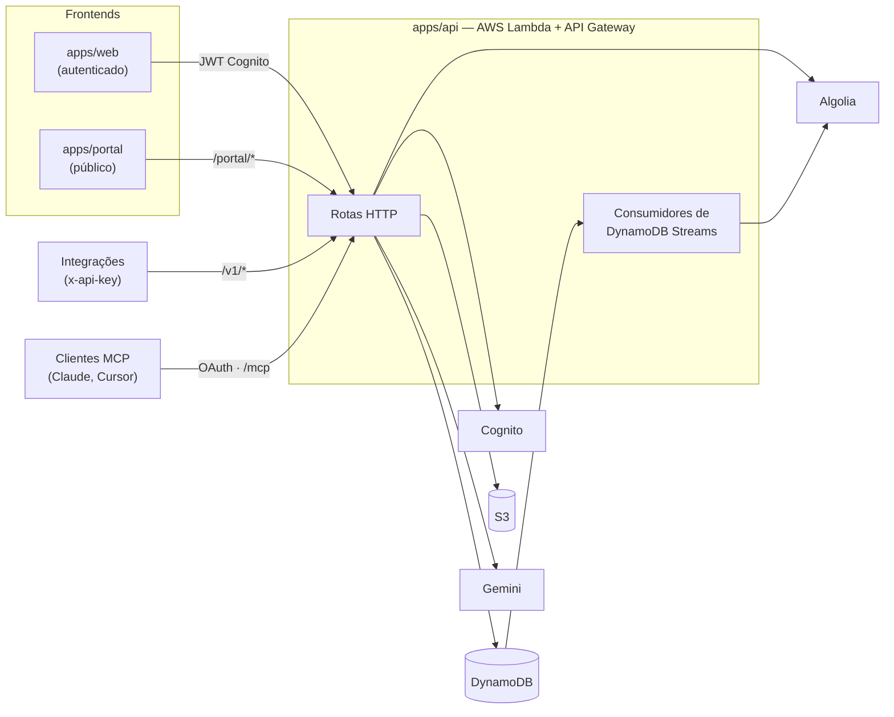

# Collectshare

**Português** · [English](./README.en.md)

Plataforma para criar formulários, coletar respostas e publicá-las como **dados abertos** — com anonimização de dados pessoais (LGPD) antes de qualquer publicação.

- **App** (`apps/web`): crie formulários, acompanhe respostas em um dashboard com filtros, exporte CSV e gerencie chaves de API.
- **Portal de dados abertos** (`apps/portal`): busca pública nos datasets publicados, visualização paginada e download em CSV, sem login.
- **API externa `/v1`**: acesso programático com chaves de API e escopos.
- **Servidor MCP**: conecte o Claude, Claude Code ou Cursor à sua conta via OAuth e gerencie formulários por linguagem natural.

## Arquitetura



## Stack

| Parte | Tecnologias |
|---|---|
| Monorepo | pnpm workspaces, Turborepo |
| `apps/api` | TypeScript, Serverless Framework, AWS Lambda (Node 24, arm64), DynamoDB (single-table), Cognito, S3, SQS, Algolia, Gemini, Zod, Vitest |
| `apps/web` | React 19, Vite, TailwindCSS v4, TanStack Query, React Router |
| `apps/portal` | React 19, Vite, TailwindCSS v4, TanStack Query |
| `packages/ui` | Componentes do design system compartilhados (`@monorepo/ui`) |
| `packages/shared` | Entidades, tipos e enums compartilhados (`@monorepo/shared`) |
| `infra/` | Terraform (hospedagem e CI/CD do portal) |

## Estrutura

```
apps/
  api/        # Backend serverless (Clean Architecture + DI próprio)
  web/        # App autenticado
  portal/     # Portal público de dados abertos
packages/
  shared/     # Domínio compartilhado
  ui/         # Design system
infra/        # Terraform do portal
docs/         # Notas de design e PRDs
openspec/     # Propostas de mudança (OpenSpec)
```

## Primeiros passos

Pré-requisitos: **Node.js 24**, **pnpm 10** e, para deploy da API, credenciais AWS (perfil `pessoal`) e o Serverless Framework.

```bash
pnpm install
pnpm dev          # sobe web e portal (Vite)
```

A API não roda localmente — ela é publicada na AWS. Durante o desenvolvimento, use `pnpm --filter @monorepo/api typecheck` e `pnpm --filter @monorepo/api test`, e aponte os frontends para uma stack de dev.

### Variáveis de ambiente

Cada app tem um `.env` (os frontends têm `.env-exemple` como modelo).

| App | Variáveis |
|---|---|
| `apps/web` | `VITE_API_URL`, `VITE_APP_CLARITY_ID`, `VITE_APP_SENTRY_DSN`, `SENTRY_AUTH_TOKEN`, `SENTRY_ORG`, `SENTRY_PROJECT` |
| `apps/portal` | `VITE_API_URL`, `VITE_WEB_APP_URL` |
| `apps/api` | `ALGOLIA_APP_ID`, `ALGOLIA_ADMIN_API_KEY`, `ALGOLIA_INDEX_NAME`, `MASTER_SECRET`, `EXPORT_SECRET`, `GEMINI_API_KEY`, `WEB_APP_URL`, `API_DOMAIN_NAME`, `ROUTE53_HOSTED_ZONE_ID`, `COGNITO_EMAILS_FROM`, `COGNITO_EMAILS_REPLY_TO`, `SES_ARN` |

> Trocar `MASTER_SECRET` invalida todas as chaves de API e tokens MCP. Trocar `EXPORT_SECRET` muda todos os valores pseudonimizados já publicados.

## Comandos

| Onde | Comando | O que faz |
|---|---|---|
| raiz | `pnpm dev` / `pnpm build` / `pnpm lint` | Roda em todos os apps via Turborepo |
| raiz | `pnpm deploy` | Deploy da API |
| `apps/api` | `pnpm typecheck` · `pnpm test` | Checagem de tipos · testes (Vitest) |
| `apps/api` | `pnpm deploy` | `sls deploy --stage dev` |
| `apps/api` | `pnpm dev:email` | Preview dos templates de e-mail |
| `apps/api` | `pnpm verify:mcp-oauth` · `pnpm verify:mcp-server` | Testes ponta a ponta do OAuth e do servidor MCP numa stack publicada |
| `apps/web` / `apps/portal` | `pnpm dev` · `pnpm build` · `pnpm typecheck` · `pnpm lint` | Desenvolvimento e build |

`start-dev.sh` abre uma sessão tmux com janelas para a raiz, a API e o web.

## Privacidade (LGPD)

Nenhum dado pessoal sai cru para fora da visão do dono do formulário.

1. Ao salvar as perguntas, cada uma é classificada quanto a dado pessoal: heurísticas (regex/palavras-chave) → cache → Gemini.
2. No editor, o dono escolhe uma estratégia por pergunta: **pseudonimizar** (hash estável por formulário), **generalizar** (data → ano/mês, número → faixa, prefixo de texto, CEP → UF/DDD) ou **suprimir**.
3. Toda leitura pública ou de terceiros (portal, CSV público, `/v1/portal/*`) passa pelo motor de anonimização. Sem estratégia definida, perguntas sinalizadas como dado pessoal são pseudonimizadas por padrão.

Formulários são publicados no portal por padrão (`isPublished`), e o dono pode despublicar a qualquer momento.

## API externa (`/v1`)

Crie uma chave em **App → Chaves de API** (`cs_sk_…`, exibida uma única vez) com os escopos necessários: `portal:read`, `forms:read`, `forms:write`.

```bash
curl https://<api>/v1/forms -H "x-api-key: cs_sk_..."
```

| Método | Rota | Escopo |
|---|---|---|
| `GET` | `/v1/forms` | `forms:read` |
| `POST` | `/v1/forms` | `forms:write` |
| `PUT` | `/v1/forms/{formId}` | `forms:write` |
| `PUT` | `/v1/forms/{formId}/questions` | `forms:write` |
| `GET` | `/v1/submissions/{formId}` | `forms:read` |
| `GET` | `/v1/portal/search` | `portal:read` |
| `GET` | `/v1/portal/datasets/{formId}/data` | `portal:read` |

O contrato é uma especificação OpenAPI 3.1 em `apps/portal/public/openapi.yaml`, publicada como `/openapi.yaml` no portal e renderizada com Scalar em `/api-docs` (com cliente para testar as requisições e tema claro/escuro do portal). Exemplos prontos em `apps/api/http/`.

## Servidor MCP

O endpoint `POST /mcp` implementa o [Model Context Protocol](https://modelcontextprotocol.io) com login OAuth 2.1 (PKCE). Basta informar a URL ao cliente:

```bash
claude mcp add --transport http collectshare https://<api>/mcp
```

No claude.ai, adicione como conector personalizado. Ferramentas disponíveis: `list_forms`, `get_form`, `create_form`, `update_form`, `insert_questions`, `get_form_submissions`, `search_datasets`, `get_dataset_data`.

> Uma conexão dá acesso total à sua conta. Conecte apenas clientes em que você confia: as respostas de formulários são escritas por terceiros e podem conter instruções maliciosas (prompt injection).

## Deploy

- **CI (GitHub Actions):** instala e builda tudo em push/PR para `main`.
- **CD (AWS CodeBuild):** uma *pre-release* no GitHub publica em **dev**; uma *release* publica em **prod**. Cada app tem seu `buildspec.yml` (API via Serverless; web e portal via S3 + CloudFront).
- **Infra do portal:** Terraform em `infra/portal-spa` e `infra/portal-codebuild`, usando o perfil AWS `pessoal`.

```bash
cd infra/portal-spa && terraform init && terraform plan
```

## Documentação adicional

- [`CLAUDE.md`](./CLAUDE.md): guia técnico detalhado da arquitetura (em inglês)
- [`apps/api/docs/API_DOCS.md`](./apps/api/docs/API_DOCS.md): rotas autenticadas por Cognito
- [`docs/`](./docs): notas de design (portal de dados abertos, anonimização, dashboard)
